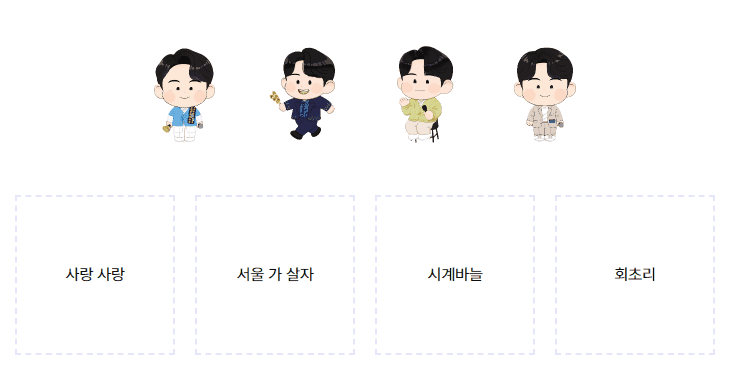

# Drag & Drop

## [example1 바로가기](dragndrop1/README.md)

<a href="https://rigood.github.io/TIL-js/dragndrop/dragndrop1/dragndrop.html">예제 바로가기</a>

- dragover, dragleave, drop 이벤트

 

## [example2 바로가기](dragndrop2/README.md)

<a href="https://rigood.github.io/TIL-js/dragndrop/dragndrop2/dragndrop2.html">예제 바로가기</a>

- dragstart, dragend, dragover, drop 이벤트
- 요소 순서 바꾸기

 

## [example3 바로가기](dragndrop3/README.md)

<a href="https://rigood.github.io/TIL-js/dragndrop/dragndrop3/dragndrop3.html">예제 바로가기</a>

- dragstart, dragenter, dragover, dragleave, drop 이벤트
- data- 속성, HTML Drag and Drop API의 dataTransfer 속성

