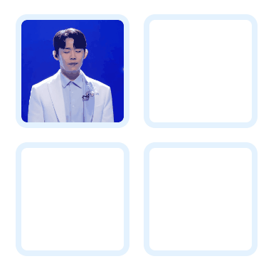

## [📙 Tutorial : Drag & Drop using HTML CSS & JavaScript](https://youtu.be/vJn5_SytV_U)



- 이미지를 박스에 드래그 앤 드롭 할 수 있는 예제입니다.
- 이미지를 다른 박스 위로 드래그하면 박스 테두리와 배경색이 변경됩니다.

<br>

```html
<div class="box">
  <div class="img" draggable="true"></div>
</div>
<div class="box"></div>
<div class="box"></div>
<div class="box"></div>
```

- 4개의 박스를 만들고, 첫번째 박스 안에 이미지가 들어갈 div 태그를 생성합니다.
- 이미지의 `draggable 속성을  true로 지정`하여 드래그할 수 있게 만들어 주고, css로 배경화면 이미지를 지정합니다.

<br>

```javascript
boxes.forEach((box) => {
  box.addEventListener("dragover", (e) => {
    e.preventDefault();

    if (box === img.parentElement) return;

    box.classList.add("hovered");
  });

  box.addEventListener("dragleave", () => {
    box.classList.remove("hovered");
  });

  box.addEventListener("drop", () => {
    box.appendChild(img);
    box.classList.remove("hovered");
  });
});
```

- querySelectorAll을 통해 박스들을 선택하고, forEach문을 통해 각 박스에 `dragover`, `dragleave`, `drop` 이벤트 핸들러를 달아줍니다.

<br>

- **`dragover`**

  - **드래그한 요소가 영역 위에 위치할 때 발생하는 이벤트(현재 예시에서 이미지가 박스 위에 위치할 때 박스에 발생하는 이벤트)**
  - `e.preventDefault()`를 호출해야 드래그한 요소를 `drop` 받을 수 있습니다.
  - 동일한 박스에서 드래그한 경우에는 스타일을 바꾸지 않고, 다른 박스 위에 드래그한 경우에만 박스에 hovered 클래스를 추가하여 css를 통해 테두리와 배경색을 변경합니다.

<br>

- **`dragleave`**

  - **드래그한 요소가 영역을 벗어날 때 발생하는 이벤트(현재 예시에서 이미지가 박스를 벗어날 때 박스에 발생하는 이벤트)**
  - 이미지가 박스를 벗어나면 hovered 클래스를 제거하여 점선 테두리와 배경색을 없앱니다.

<br>

- **`drop`**
  - **드래그한 요소가 영역에 드롭될 때 발생하는 이벤트**
  - 이미지가 박스에 드롭되면 이미지를 박스의 자식 요소로 추가하고, 박스의 hovered 클래스를 제거하여 점선 테두리와 배경색을 없앱니다.

<br>
