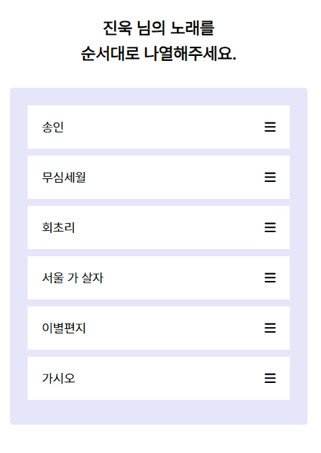

## [📙 Tutorial : How To Build Sortable Drag & Drop With Vanilla Javascript](https://youtu.be/jfYWwQrtzzY)

<a href="https://rigood.github.io/TIL-js/dragndrop/dragndrop2/dragndrop2.html" target="_blank">예제 바로가기</a>



- 드래그 앤 드롭을 통해 노래를 순서대로 나열하고, 정답을 맞추면 배경색이 변경되는 예제입니다.

<br>

```html
<!-- html 문서 -->

<section class="container">
  <div class="draggable" draggable="true">
    <span class="text">송인</span>
    <i class="fas fa-bars"></i>
  </div>
  <div class="draggable" draggable="true">
    <span class="text">무심세월</span>
    <i class="fas fa-bars"></i>
  </div>
  <div class="draggable" draggable="true">
    <span class="text">회초리</span>
    <i class="fas fa-bars"></i>
  </div>
  <div class="draggable" draggable="true">
    <span class="text">서울 가 살자</span>
    <i class="fas fa-bars"></i>
  </div>
  <div class="draggable" draggable="true">
    <span class="text">이별편지</span>
    <i class="fas fa-bars"></i>
  </div>
  <div class="draggable" draggable="true">
    <span class="text">가시오</span>
    <i class="fas fa-bars"></i>
  </div>
</section>
```

- 컨테이너를 만들고 그 안에 노래 제목들을 배치합니다. `draggable 속성을 true로 지정`하여 드래그 할 수 있게 만들어 줍니다.

<br>

```javascript
// js 파일

const draggables = document.querySelectorAll(".draggable");

draggables.forEach((draggable) => {
  draggable.addEventListener("dragstart", () => {
    draggable.classList.add("dragging");
  });

  draggable.addEventListener("dragend", () => {
    draggable.classList.remove("dragging");
  });
});
```

- querySelectorAll을 통해 클래스명이 draggable인 요소들을 선택한 후, forEach문을 통해 각 요소에 `dragstart`, `dragend` 이벤트 핸들러를 달아줍니다.

- **드래그가 시작되면 dragging 클래스를 달아주고, 드래그가 끝나면 dragging 클래스를 제거**합니다. css를 통해 dragging 클래스가 달린 노래 제목은 opacity를 조절해 불투명하게 만들어 줍니다.

<br>

```javascript
container.addEventListener("dragover", (e) => {
  e.preventDefault();

  const draggable = document.querySelector(".dragging");
  const afterElement = getDragAfterElement(container, e.clientY);

  container.insertBefore(draggable, afterElement);
});
```

- 컨테이너에는 `dragover` 이벤트 핸들러를 달아줍니다. 컨테이너 위로 무언가가 드래그 될 때 발생하는 이벤트입니다.

- `e.preventDefault()`를 호출해야 나중에 drop 이벤트를 받을 수 있습니다.

- 드래그 할 때 실시간으로 `요소 위치를 바꿔줍니다.` 현재 dragging하고 있는 노래를 선택하여 해당 노래의 바로 아래에 있는 요소 위에 넣어줍니다.

<br>

```javascript
function getDragAfterElement(container, y) {
  const draggableElements = [
    ...container.querySelectorAll(".draggable:not(.dragging)"),
  ];

  return draggableElements.reduce(
    (closest, child) => {
      const box = child.getBoundingClientRect();
      const offset = y - box.top - box.height / 2;
      if (offset < 0 && offset > closest.offset) {
        return { offset: offset, element: child };
      } else {
        return closest;
      }
    },
    { offset: Number.NEGATIVE_INFINITY }
  ).element;
}
```

- 현재 드래그하고 있는 요소의 바로 밑에 있는 요소를 찾아내는 로직입니다. `reduce 함수`를 이용하여 draggable한 요소들을 차례대로 돌면서 `offset 값` 비교를 통해 가장 가까운 요소를 찾아냅니다.

- `offset 값이 양수`이면 현재 드래그하고 있는 노래보다 `위에 있는 요소`이고, `offset 값이 음수`이면 현재 드래그하고 있는 노래보다 `아래에 위치하는 요소`입니다.

- offset 값이 음수이면서(아래에 있는 요소이면서), 현재 가장 가까운 요소의 offset 값보다 offset 값이 클 때(음수이기 때문에 값이 커야 가장 가까운 요소임) offset 값과 해당 요소를 객체로 반환합니다.

<br>

```javascript
container.addEventListener("drop", () => {
  const correctArray = [
    "회초리",
    "무심세월",
    "송인",
    "가시오",
    "이별편지",
    "서울 가 살자",
  ];

  const draggables = container.querySelectorAll(".draggable");
  const currentArray = [...draggables].map((draggable) => draggable.innerText);

  const equals = (a, b) => JSON.stringify(a) === JSON.stringify(b);

  if (equals(correctArray, currentArray)) {
    container.style.backgroundColor = "lavenderblush";
    alert("정답입니다💜");
  }
});
```

- 컨테이너에 `drop` 이벤트 핸들러를 달아줍니다. drop할 때마다 현재 노래 순서가 정답인지를 확인하여, 정답인 경우 컨테이너의 배경색을 변경하고 정답 알림을 띄워줍니다.

- 현재 배열과 정답 배열을 비교할 때는 `동등 연산자(==)를 통한 비교가 불가능`하므로(배열은 참조형이기 때문에 값이 아닌 주소값을 비교합니다.) `JSON.stringify() 메서드`를 통해 배열을 문자열화하여 비교합니다.

<br>
