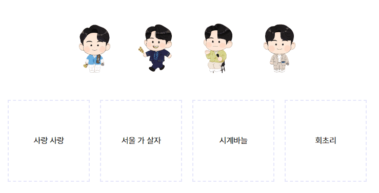

# Drag & Drop

[📙 Tutorial : HTML Drag and Drop API](https://youtu.be/7HUCAYMylCQ)

<a href="https://rigood.github.io/TIL-js/dragndrop/dragndrop3/dragndrop3.html">예제 바로가기</a>



- 드래그 앤 드롭을 통해 노래에 맞는 캐릭터를 연결하는 예제입니다.
- 드래그 할 때 상자 테두리가 점선으로 변경됩니다.
- 노래 제목에 맞게 드래그한 경우, 캐릭터 이미지가 상자로 이동하고, 상자 배경색이 변경됩니다.
- 이미 드래그된 캐릭터는 다시 드래그할 수 없도록 하고, opacity를 조절하였습니다.

<br>

```html
<!-- html 문서 -->

<section class="draggable-elements">
  
  
  
  
</section>

<section class="droppable-elements">
  <div class="droppable" data-draggable-id="love">
    <span>사랑 사랑</span>
  </div>
  <div class="droppable" data-draggable-id="seoul">
    <span>서울 가 살자</span>
  </div>
  <div class="droppable" data-draggable-id="clock">
    <span>시계바늘</span>
  </div>
  <div class="droppable" data-draggable-id="rod"><span>회초리</span></div>
</section>
```

- 캐릭터 이미지는 드래그할 수 있도록 `draggable=true`로 설정합니다. 정답 확인을 위해 `id 값`을 지정하고, `data- 속성`을 통해 컬러값을 추가하였습니다.
- 상자에도 정답 확인을 위하여 `data- 속성`을 통해 id 값을 저장하였습니다.

<br>

```javascript
const draggableElements = document.querySelectorAll(".draggable");
const droppableElements = document.querySelectorAll(".droppable");

draggableElements.forEach((draggable) => {
  draggable.addEventListener("dragstart", dragStart);
});

droppableElements.forEach((droppable) => {
  droppable.addEventListener("dragenter", dragEnter);
  droppable.addEventListener("dragover", dragOver);
  droppable.addEventListener("dragleave", dragLeave);
  droppable.addEventListener("drop", drop);
});
```

- querySelectorAll을 통해 캐릭터 이미지(draggableElements)와 상자(droppableElements)를 선택합니다.
- 캐릭터 이미지에는 `dragstart` 이벤트를, 상자에는 `dragenter`, `dragover`, `dragleave`, `drop` 이벤트를 달아줍니다.

<br>

```javascript
function dragStart(event) {
  event.dataTransfer.setData("text", event.target.id);
}
```

- 드래그가 시작되면, `event객체의 dataTransfer`를 통해 text라는 데이터에 id값을 저장합니다. 여기서 설정한 data는 drop 이벤트 핸들러에서 사용할 수 있습니다.

<br>

```javascript
function dragEnter(event) {
  if (!event.target.classList.contains("dropped")) {
    event.target.classList.add("droppable-hover");
  }
}

function dragOver(event) {
  if (!event.target.classList.contains("dropped")) {
    event.preventDefault();
  }
}

function dragLeave(event) {
  if (!event.target.classList.contains("dropped")) {
    event.target.classList.remove("droppable-hover");
  }
}
```

- 드래그가 시작되면 상자에 `droppable-hover` 클래스를 추가하여 상자 크기가 커지고 점선 테두리로 바뀌는 css 스타일을 적용해줍니다. 드래그가 끝나면 해당 클래스를 제거합니다

- 상자에 `dropped` 라는 클래스가 있는 경우에는(이미 캐릭터 이미지가 드롭된 경우에는) `droppable-hover` 클래스를 추가하지 않습니다.

- `dragover` 이벤트 핸들러에서 event.preventDefault()를 호출해야 추후 drop 이벤트를 사용할 수 있습니다.

<br>

```javascript
function drop(event) {
  event.preventDefault();
  event.target.classList.remove("droppable-hover");

  const draggableElementData = event.dataTransfer.getData("text");
  const droppableElementData = event.target.getAttribute("data-draggable-id");

  if (draggableElementData === droppableElementData) {
    event.target.classList.add("dropped");

    const draggableElement = document.getElementById(draggableElementData);

    event.target.style.backgroundColor = draggableElement.dataset.color;

    draggableElement.classList.add("dragged");
    draggableElement.setAttribute("draggable", false);

    event.target.insertAdjacentHTML(
      "afterbegin",
      ``
    );
  }
}
```

- 캐릭터 이미지가 상자 위로 드롭된 경우 적용할 로직입니다.

- `event.preventDefault()`를 통해 드롭 이벤트의 기본동작을 막습니다. (예를 들어, 링크 태그를 상자 위로 드롭한 경우 링크가 열리는 동작을 막아줍니다.)

- dragstart 이벤트에서 설정한 `dataTransfer` 데이터를 받아와 `draggableElementData`라는 변수에 저장하고, `droppableElementData`에는 data- 속성을 통해 상자에 저장했던 id값을 불러옵니다.

- 만약 두 값이 일치하면, 상자에 `dropped` 클래스를 추가하고 캐릭터 이미지에 저장했던 컬러값을 가져와 상자 배경색을 바꿔줍니다. 캐릭터 이미지에는 `dragged` 클래스를 추가하여 opacity를 조절하고, 더 이상 드래그할 수 없도록 `draggable` 속성을 false로 설정해줍니다.

- `insertAdjacentHTML` 메서드를 이용하여 상자 안에 이미지 태그를 삽입합니다.
