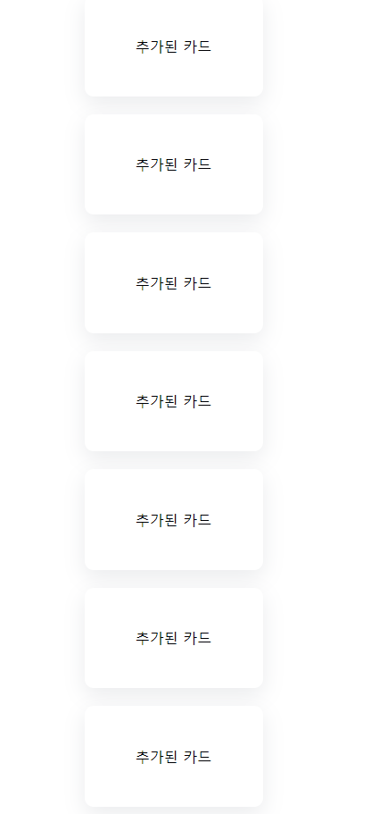

# Intersection Observer API

📆 2022. 10. 25. 화요일

[📙 Tutorial : Learn Intersection Observer In 15 Minutes](https://youtu.be/2IbRtjez6ag)



<br>

- Intersection Observer API

  ```js
  const observer = new IntersectionObserver(콜백함수, 옵션);
  ```

- 관찰중인 요소가 뷰포트와 `교차`하는지(화면 내에 있는지) 감지하는 API

<br>

- `콜백함수` : 관찰이 시작되면 실행할 함수를 지정한다.

  - `entries`는 배열 형태로 관찰중인 요소를 담는다.  
    관찰중인 요소를 인자로 받아서, 그 요소들로 무엇을 할지 코드를 작성한다.

  - 위 예제에서는 관찰중인 요소가 교차중일때(`isIntersecting`, 요소가 뷰포트 내에 위치할 때)  
    show 라는 클래스를 붙여주고, 교차중이 아닐 때에는(뷰포트를 벗어날 때) 클래스를 제거하고 있다.

- `옵션` : 객체 형식으로 옵션을 지정한다.

  - `threshold` 는 한계점이라는 뜻으로, isIntersecting 여부를 판단하는 기준이 된다.  
    threshold가 1이면, 요소 전체가 뷰포트 내에 위치할 때 교차되었다고 간주하고,  
    threshold가 0.5이면, 요소 절반이 보일 때 교차되었다고 간주한다.

  - `root` 는 화면의 기준을 무엇으로 할 지 정하는 옵션이다.  
    따로 지정하지 않으면 viewport 기준으로 화면이 설정된다.

  - `rootMargin` 은 화면 영역을 margin으로 조절할 수 있는 옵션으로,  
    rootMargin이 -100px이라면 화면을 위아래 100px만큼 축소한다는 의미이고,  
    rootMargin이 100px이라면 화면을 위아래 100px만큼 확대한다는 의미이다.

<br>

- `observe` 메서드를 통해 대상을 관찰한다.

  - querySelectorAll을 통해 카드들을 선택하고, forEach를 통해 observer(IntersectionObserver 인스턴스)가 각각의 카드를 관찰하도록 지정한다.

- 관찰을 중단할 때는 `unobserver` 메서드를 사용한다.

</br>

#### 소스 코드

```javascript
const cards = document.querySelectorAll(".card");
const cardContainer = document.querySelector(".card-container");

function loadNewCards() {
  for (let i = 0; i < 10; i++) {
    const card = document.createElement("div");
    card.textContent = "추가된 카드";
    card.classList.add("card");
    observer.observe(card);
    cardContainer.append(card);
  }
}

const lastCardObserver = new IntersectionObserver((entries) => {
  const lastCard = entries[0];

  if (!lastCard.isIntersecting) return;
  loadNewCards();

  lastCardObserver.unobserve(lastCard.target);
  lastCardObserver.observe(document.querySelector(".card:last-child"));
});

const observer = new IntersectionObserver(
  (entries) => {
    entries.forEach((entry) => {
      entry.target.classList.toggle("show", entry.isIntersecting);
    });
  },
  {
    rootMargin: "-100px",
  }
);

lastCardObserver.observe(document.querySelector(".card:last-child"));

cards.forEach((card) => {
  observer.observe(card);
});
```

#### 애니메이션 관련 CSS

```css
.card {
  opacity: 0;
  transform: translateX(100px);
  transition: 150ms;
}

.card.show {
  transform: translateX(0);
  opacity: 1;
}
```
