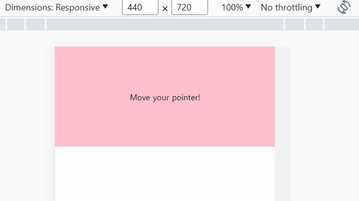

# [📙 Learn Pointer Events In 15 Minutes](https://youtu.be/MhUCYR9Tb9c)

## [Pointer 예제 README 바로가기](pointer/README.md)

<a href="https://rigood.github.io/TIL-js/pointer/pointer/pointer.html" target="_blank">예제 바로가기</a>

- pointerdown, pointermove, pointerup 이벤트

 

## [Timeline 예제 README 바로가기](timeline/README.md)

<a href="https://rigood.github.io/TIL-js/pointer/timeline/timeline.html" target="_blank">예제 바로가기</a>

- pointerdown, pointermove 이벤트
- setPointerCaptrue 메서드

 
