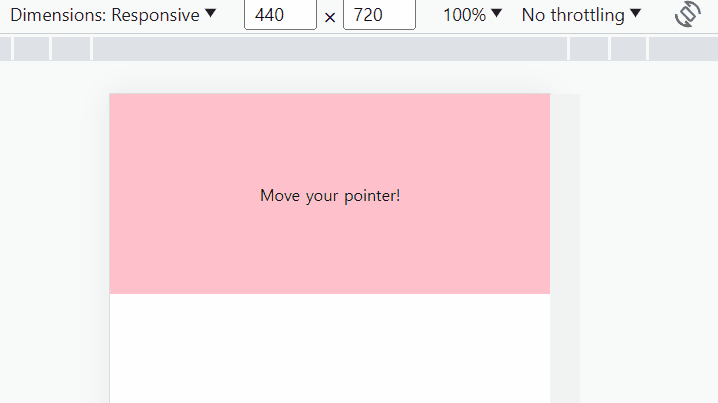

<a href="https://rigood.github.io/TIL-js/pointer/pointer/pointer.html" target="_blank">예제 바로가기</a>

### 포인터 이벤트 종류

포인터 이벤트는 마우스, 터치, 펜과 같은 포인팅 기기에 반응합니다.

`pointerdown`: 포인터가 눌린 경우  
`pointermove`: 포인터가 이동하는 경우  
`pointerup`: 포인터를 떼는 경우

<br>

### 포인터를 따라 움직이는 빨간점 만들기



<br>

```js
// 포인터가 눌린 지점의 위치 좌표와 pointerId 값을 받아 빨간점을 생성합니다.
container.addEventListener("pointerdown", (e) => {
  const dot = document.createElement("div");
  dot.classList.add("dot");

  dot.id = e.pointerId;
  positionDot(e, dot);

  document.body.append(dot);
});

// 포인터가 움직일 때마다 빨간점의 위치 좌표를 수정합니다.
container.addEventListener("pointermove", (e) => {
  const dot = document.getElementById(e.pointerId);

  if (dot == null) return;

  positionDot(e, dot);
});

// 포인터를 떼면 빨간점을 제거합니다.
container.addEventListener("pointerup", (e) => {
  const dot = document.getElementById(e.pointerId);

  if (dot == null) return;

  dot.remove();
});

// 포인터 이벤트가 취소되는 경우 빨간점을 제거합니다.
container.addEventListener("pointercancel", (e) => {
  const dot = document.getElementById(e.pointerId);

  if (dot == null) return;

  dot.remove();
});

// 이벤트 객체로부터 정보를 받아 빨간점의 위치 좌표, 너비 등을 지정합니다.
function positionDot(e, dot) {
  dot.style.width = `${e.width * 5}px`;
  dot.style.height = `${e.height * 5}px`;
  dot.style.left = `${e.pageX}px`;
  dot.style.top = `${e.pageY}px`;
}
```

<br>
