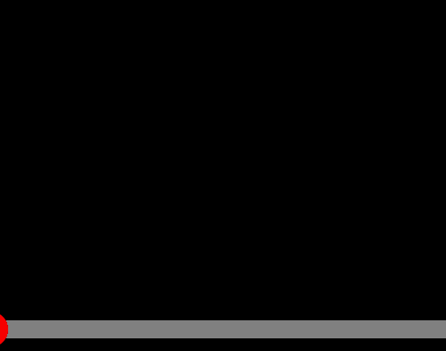
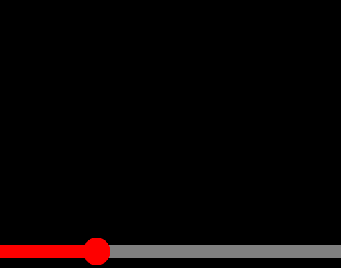

### 비디오 타임라인 만들기

<br>



타임라인을 누른 지점의 x좌표를 받아 해당 위치까지 빨간 재생바를 표시합니다.

```js
timeline.addEventListener("pointerdown", (e) => {
  setTimelinePosition(e);
});

function setTimelinePosition(e) {
  const rect = timeline.getBoundingClientRect();
  const handleWidth = (e.clientX / rect.width) * 100;
  timelineBar.style.width = `${handleWidth}%`;
}
```

<br>
<br>


빨간 재생바를 움직이는 동작을 표현하기 위해, `pointerdown` 이벤트 리스너 안에 `pointermove` 이벤트 리스너를 추가합니다.

```js
timeline.addEventListener("pointerdown", (e) => {
  setTimelinePosition(e);

  timeline.addEventListener("pointermove", setTimelinePosition);
});
```

<br>
<br>


◀ 버그

마우스를 뗀 이후에도 재생바가 움직이는 버그를 해결하기 위해, `pointerup`을 할 때 `pointermove` 이벤트에 걸려있던 `setTimelinePosition 함수`를 제거하는 이벤트를 추가합니다. pointerup의 addEventListener의 세번째 인자로 `{once: true}` 옵션을 추가하여 이벤트가 단 한번만 실행되도록 합니다.

```js
timeline.addEventListener("pointerdown", (e) => {
  setTimelinePosition(e);

  timeline.addEventListener("pointermove", setTimelinePosition);
  timeline.addEventListener(
    "pointerup",
    () => {
      timeline.removeEventListener("pointermove", setTimelinePosition);
    },
    { once: true }
  );
});
```

<br>
<br>



타임라인 바깥에서도 재생바를 움직이기 위해서 `setPointerCapture` 메서드를 이용합니다. setPointerCapture 메서드는 화면에서 일어나는 모든 포인터 이벤트를 capture해서 특정 요소에서(현재 예제에서는 timeline) 해당 이벤트가 일어난 것처럼 바꿔주는 역할을 합니다. 함수의 인자로 `e.pointerId`를 넣어줍니다.

```js
timeline.addEventListener("pointerdown", (e) => {
  timeline.setPointerCapture(e.pointerId);
  setTimelinePosition(e);

  timeline.addEventListener("pointermove", setTimelinePosition);
  timeline.addEventListener(
    "pointerup",
    () => {
      timeline.removeEventListener("pointermove", setTimelinePosition);
    },
    { once: true }
  );
});
```
