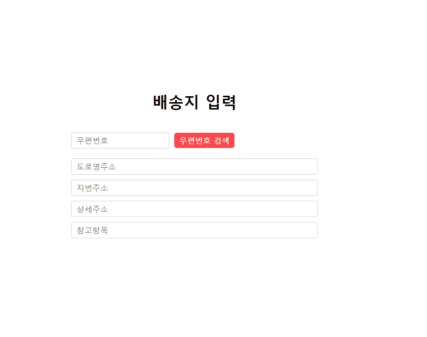

# 📬 다음 우편번호 API 사용 예제

<a href="https://rigood.github.io/TIL-js/postcode/postcode.html">예제 바로가기</a>

- '우편번호 찾기' 버튼을 클릭하면 `팝업창을 통해 주소를 검색`할 수 있습니다.
- 사용자가 선택한 주소와 우편번호를 페이지에 표시하고, 상세주소를 바로 입력할 수 있도록 input에 커서를 포커스합니다.



<br>

## 0. 다음 우편번호 API 특징

- 별도의 회원가입이나 인증키가 필요하지 않지 않습니다.
- 사용량에 제한이 없는 무료 API 입니다.

<br>

## 1. 우편번호 서비스 js 파일 삽입

- html 문서의 head 태그 안에 `Daum에서 제공한 js 파일을 삽입`합니다.
- script 태그에 `defer` 속성을 추가하여 페이지가 모두 로드된 후 js 파일을 실행합니다.

```html
<script
  defer
  src="//t1.daumcdn.net/mapjsapi/bundle/postcode/prod/postcode.v2.js"
></script>
```

<br>

## 2. 우편번호 검색버튼 클릭 시 팝업창 열기

```js
const searchBtn = document.getElementById("search-btn");

searchBtn.addEventListener("click", handlePostcodSearch);
```

- 검색버튼 클릭 시 실행할 콜백함수를 연결합니다.

<br>

```js
function handlePostcodSearch() {
  const width = 500;
  const height = 500;

  new daum.Postcode({
    oncomplete: openPostcodeSearch,
    onclose: focusDetailAddressInput,
    width,
    height,
  }).open({
    popupTitle: "우편번호 찾기",
    left: window.screen.width / 2 - width / 2,
    top: window.screen.height / 2 - height / 2,
  });
}
```

- new 연산자와 생성자 함수를 이용하여 `daum.Postcode 객체`를 생성하고, `open 함수`를 통해 우편번호 찾기 팝업을 띄워줍니다.

- `width, height` 속성을 통해 너비와 높이를 지정하고, `open 함수의 left, top 속성`을 통해 팝업창을 가운데로 정렬합니다.

<br>

## 3. 우편번호 검색이 완료된 후 주소 정보 받아 화면에 표시하기

- input 요소들을 선택하고, 우편번호 검색 결과 목록에서 결과값을 클릭한 경우(oncomplete) 실행할 콜백함수를 정의합니다.

- 사용자가 클릭한 주소 정보가 콜백함수의 인자(data)로 들어옵니다.

```js
const postcode = document.getElementById("postcode");
const roadAddress = document.getElementById("road-address");
const jibunAddress = document.getElementById("jibun-address");
const detailAddress = document.getElementById("detail-address");
const extraAddress = document.getElementById("extra-address");

function openPostcodeSearch(data) {
  // 우편번호와 도로명주소, 지번주소를 해당 필드에 넣는다.
  postcode.value = data.zonecode;
  roadAddress.value = data.roadAddress;
  jibunAddress.value = data.jibunAddress;

  // 참고항목 설정하기
  let extraRoadAddr = "";

  // 법정동명이 있을 경우 참고항목에 추가한다. (법정리는 제외)
  // 법정동의 경우 마지막 문자가 "동/로/가"로 끝난다.
  if (data.bname !== "" && /[동|로|가]$/g.test(data.bname)) {
    extraRoadAddr += data.bname;
  }

  // 건물명이 있고, 공동주택일 경우 참고항목에 추가한다.
  if (data.buildingName !== "" && data.apartment === "Y") {
    extraRoadAddr +=
      extraRoadAddr !== "" ? ", " + data.buildingName : data.buildingName;
  }

  // 표시할 참고항목이 있을 경우, 괄호까지 추가한 최종 문자열을 만든다.
  if (extraRoadAddr !== "") {
    extraRoadAddr = " (" + extraRoadAddr + ")";
  }

  // 참고항목이 있는 경우 해당 필드에 넣는다.
  if (data.roadAddress !== "") {
    extraAddress.value = extraRoadAddr;
  } else {
    extraAddress.value = "";
  }
}
```

<br>

## 4. 팝업창을 닫은 후, 상세정보 input에 커서 포커스하기

- 사용자가 검색 결과를 선택하거나 브라우저 닫기 버튼을 통해 팝업창을 닫을 때(onclose) 실행되는 콜백함수를 연결합니다.

```js
function focusDetailAddressInput(state) {
  // 사용자가 검색 결과를 선택하여 팝업창을 닫은 경우
  if (state === "COMPLETE_CLOSE") {
    detailAddress.focus();
  }
}
```

- 콜백함수의 인자인 `state`는 우편번호 찾기 화면이 어떻게 닫혔는지에 대한 상태 변수입니다.

- 사용자가 검색 결과를 선택하여 팝업창을 닫은 경우 `focus() 메서드`를 통해 상세정보 입력창에 커서를 포커스합니다.
