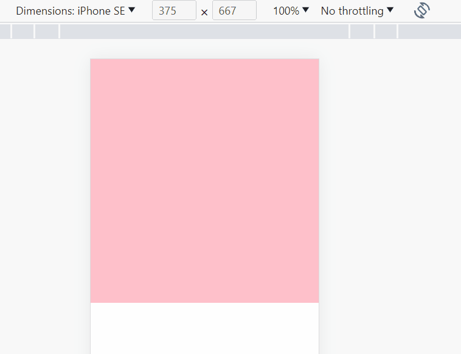
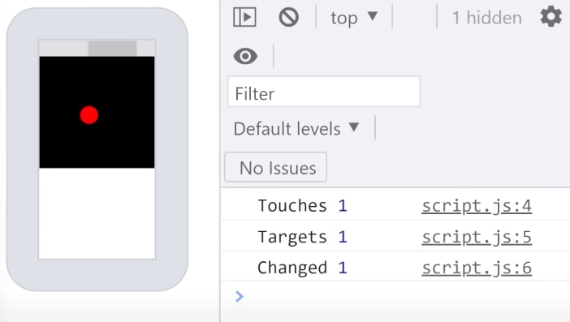
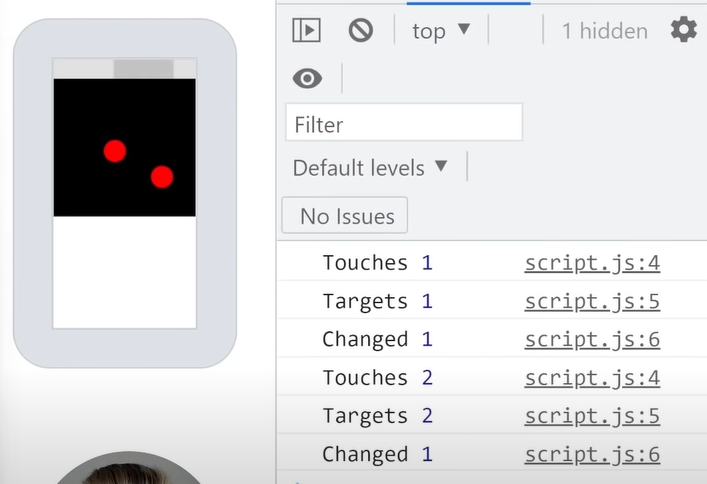

## [📙 Learn JavaScript Touch Events In 17 Minutes](https://youtu.be/TaPdgj8mucI)

[예제 바로가기](https://rigood.github.io/TIL-js/touch/touch.html)



<br>

### 터치 이벤트

- 종류: 마우스 이벤트에 mousedown, mousemove, mouseup이 있는 것처럼 터치 이벤트에는 `touchstart`, `touchmove`, `touchend`가 있다.

- `터치 가능한 기기에서만 터치 이벤트를 확인할 수 있다.` 데스크탑에서 touch 이벤트의 event 객체를 콘솔에 찍어봐도 아무런 결과가 나타나지 않으며, 모바일 기기로 토글해야 콘솔값을 확인할 수 있다.

<br>

### 터치 event 객체 주요 속성 3가지

1. `touches` : 현재 스크린에서 터치되고 있는 모든 지점을 반환
2. `targetTouches` : 현재 타겟 내에서 터치되고 있는 지점들을 반환

```js
container.addEventListener("touchstart", (e) => console.log(e));
// -> targetTouches: container 내에서 터치되고 있는 지점들을 배열로 반환
```

3. `changedTouches` : 이전 터치 이벤트와 비교하여 달라진 터치 포인트들을 반환

<br>


<br>


<br>

### 빨간점으로 터치 지점 표시하기

#### 1. touchstart 이벤트 발생 시 빨간점 생성하기

event 객체의 `changedTouches`를 받아 spread 연산자를 통해 배열로 변환한 후 forEach문을 통해 새로운 터치 포인트 개수만큼 빨간점을 생성한다. `pageX`, `pageY` 속성을 이용하여 빨간점의 위치를 잡아주고, 터치포인트 식별값인 `identifier` 속성을 이용하여 빨간점의 id로 지정한다.

```js
document.addEventListener("touchstart", (e) => {
  [...e.changedTouches].forEach((touch) => {
    // 빨간점 생성
    const dot = document.createElement("div");
    dot.classList.add("dot");

    // 위치 잡기
    dot.style.top = `${touch.pageY}px`;
    dot.style.left = `${touch.pageX}px`;

    // id 지정
    dot.id = touch.identifier;

    // DOM에 추가
    document.body.append(dot);
  });
});
```

#### 2. touchend 이벤트 발생 시 빨간점 제거하기

터치가 끝나면 identifier 값을 활용하여 빨간점을 선택하고 DOM에서 제거한다.

```js
document.addEventListener("touchend", (e) => {
  [...e.changedTouches].forEach((touch) => {
    const dot = document.getElementById(touch.identifier);
    dot.remove();
  });
});
```

#### 3. touchmove 이벤트 발생 시 빨간점 이동시키기

identifier롤 통해 빨간점을 선택하고, pageY, pageX 값을 이용하여 점의 위치를 조절한다.

```js
document.addEventListener("touchmove", (e) => {
  [...e.changedTouches].forEach((touch) => {
    const dot = document.getElementById(touch.identifier);
    dot.style.top = `${touch.pageY}px`;
    dot.style.left = `${touch.pageX}px`;
  });
});
```

#### 4. 터치가 취소될 때 빨간점 제거하기

버그, 오류 등으로 터치가 비정상적으로 끝날 때에는 touchcancel 이벤트가 실행된다.

<br>

### 터치 기반 제스처 (확대, 축소, 클릭, 스크롤 내리면 페이지 새로고침) 방지

`touchstart` 이벤트에서 `e.preventDefault()`를 호출하면 터치 기반 제스처들이 더이상 실행되지 않는다.
